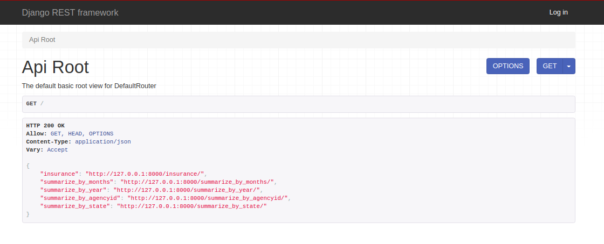

# The API
This API are a source to Fake Insurance Company information. The initial 
data was taken from Kaggle in a CSV file. To construct the system, was 
used some tools. See more below:
  ```
  - Python3
  - Pandas
  - Django-Rest
  - Djnago-Rest-Pandas
  ```
  
To install all dependeces, just have to download this repo and run:

``` 
pip install -r requirements.txt
```
## How to use API

The initial page have some basic url's, as Instances and summarized views
with differents parameters. The instances url can provide all information 
about the Company. The summarized have values grouping information by some 
parameter, as <em>months</em>, <em>years</em>, <em>agency id</em> or <em>state</em>.



### Searching for specific value

So, if you want to look just for the Insurance values related to month 4,
just have to add <em>'search/?months=4'</em> to the end of site url. Any
value to research on dataset will be the same way:

###### Avaliable querys 
  - months, 
  - state_abbr,
  - agency_id
  - year,
  
### Export report to a CSV file
Sometimes a Company need an important report about the situation of the 
year. So, for every year, it's possible to obtain an report contain 
<em>agency id</em>, <em>loss</em>, <em>earn</em> and the <em>prod line</em>.

It's just use <em>/report/data=2009</em> for example, and will download 
everything that happened on 2009. (You can change to any year that want.
If doesn't have data about the year on background, the CSV will be empity).
http://127.0.0.1:8000/report/?data=year  
